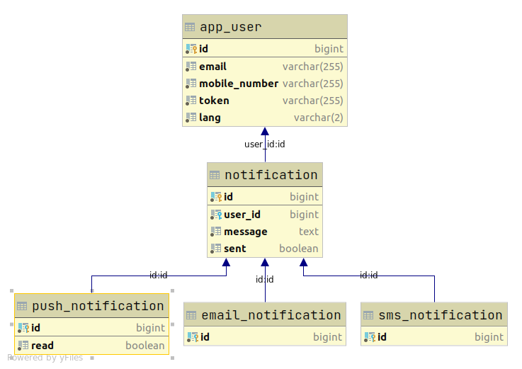

# Notification Service

## About

Notification restful web service responsible for sending notifications to customers.
* Exposes endpoints for saving notifications
* Schedules sending notifications using notifications' providers every 1 minute with limit **30** notifications
> Note:
> * Notification types are Sms, Email and Push

## API Documentation

* Open http://localhost:8080/swagger-ui.html

## ERD



## Installation

1. ```shell
   git clone https://github.com/wascode93/notification-service.git
   ```
2. ```shell
   mvn clean package -DskipTests
   ```
3. ```shell
   sudo docker-compose up
   ```